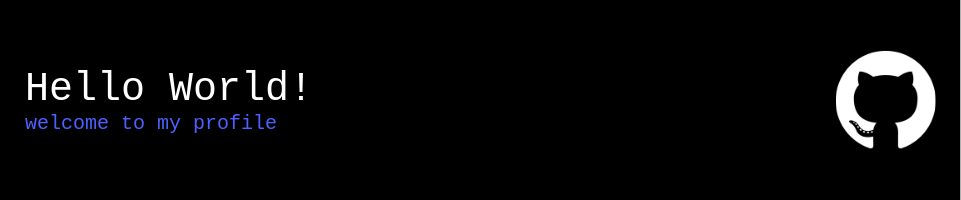

## About Me 📝

Hey there! My name is Elio, and I'm an 18-year-old aspiring software developer. I'm passionate about coding and sharing my knowledge with others. I'm currently exploring various programming languages and frameworks to expand my skill set.

## 🛠️ Skills & Technologies

- **Languages:** Python, Bash, YAML, C++, (and trying to learn more)
- **Web Development:** HTML5, CSS3, Bootstrap, NodeJS
- **Databases:** MySQL, MongoDB
- **Tools:** Git, VSCode, Docker, Kubernetes

## 💆 Interests
- **OpenSource**
- **Cybersecurity**
- **Linux**
- **Containerization**
- **DevOps**
**and way more..**

## 📊 GitHub Stats:
 

Feel free to explore my repositories and give feedback. Don't forget to ⭐️ the projects you like! 😄
